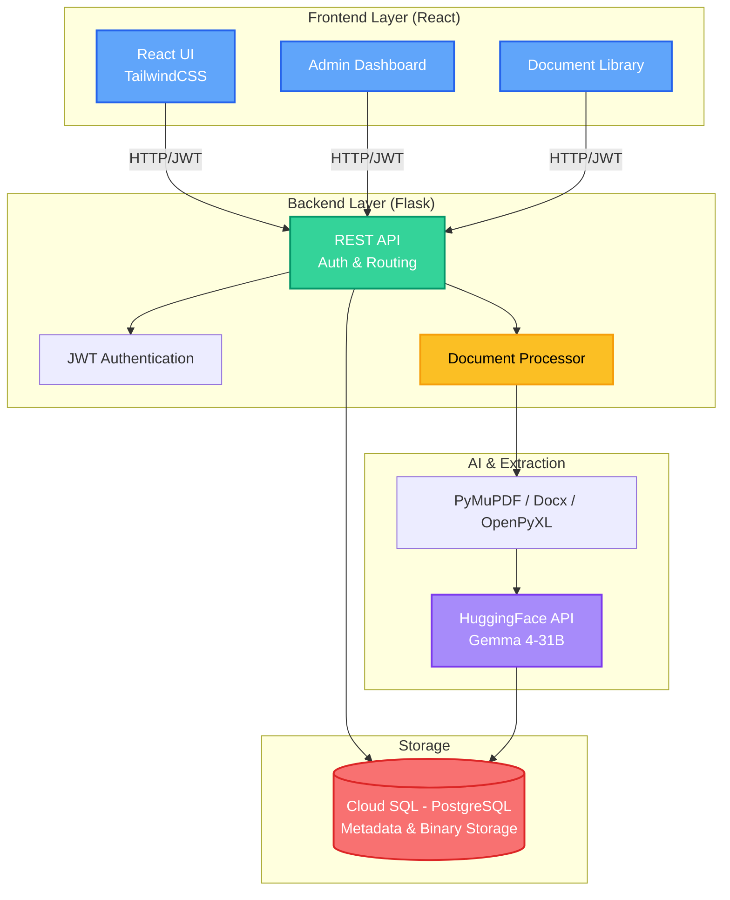
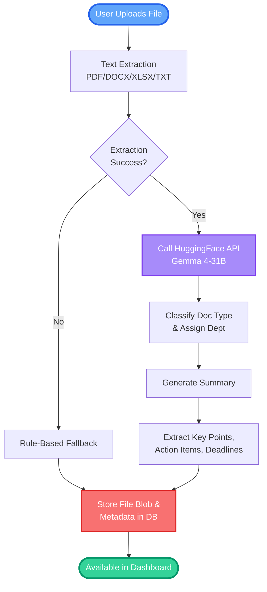

# DocIntel AI - Intelligent Document Management System

A modern document management system that automatically categorizes, summarizes, and extracts key insights from uploaded documents using AI (HuggingFace/Gemma). Designed for enterprise environments with department-level access control.

## Features

- **AI-Powered Document Processing**: Automatically extracts text from PDFs, Word docs, Excel files, etc., and uses LLMs to generate summaries, key points, and action items.
- **Smart Categorization & Routing**: The AI classifies documents by type (e.g., Invoice, Safety Report) and automatically routes them to the correct department (Engineering, HR, Procurement, etc.).
- **Role-Based Access Control (RBAC)**: Secure JWT authentication. Regular users see only their department's documents; administrators have full access.
- **Intelligent Search & Filtering**: Fast retrieval of documents based on content, department, AI-generated tags, and categories.
- **Secure Database Storage**: Files and their structured metadata are securely stored in PostgreSQL (production) or SQLite (local), eliminating reliance on external file storage for simplified deployments.
- **Cloud-Ready**: Fully containerized and optimized for deployment on Google Cloud Run and Cloud SQL.

## System Architecture

High-level overview of the InfraDoc ecosystem:



### 1. Document Processing Pipeline
The core logic for extracting value from uploaded files:



## Tech Stack

### Frontend
- **Framework**: React.js
- **Styling**: Tailwind CSS
- **Routing**: React Router
- **HTTP Client**: Axios & Fetch API

### Backend
- **Framework**: Python / Flask
- **Database ORM**: SQLAlchemy
- **Database Driver**: pg8000 (Production), SQLite (Local)
- **AI Integration**: HuggingFace Inference API (`google/gemma-4-31B-it:novita`)
- **Authentication**: JWT (PyJWT)
- **Document Parsing**: PyMuPDF (`fitz`), `python-docx`, `openpyxl`

## Architecture & Optimization

Designed for stability and seamless cloud deployment:
- **Direct Database Storage**: Removed AWS S3 dependencies by storing documents as Large Binary objects directly in PostgreSQL. This simplifies the architecture, improves local testability, and cuts costs.
- **Graceful Degradation**: If the HuggingFace API is unavailable or rate limits are reached, the system intelligently falls back to robust Regex/Rule-Based extraction algorithms.
- **Container Optimized**: Uses `python:3.11-slim` and the pure-Python `pg8000` Postgres driver to avoid heavy C-extension build requirements, ensuring lightning-fast container builds and deployments on Cloud Run.

---
## Project Setup & Run Guide

### Prerequisites
1. **Python 3.11+** installed locally.
2. **Node.js 18+** installed locally.
3. **Google Cloud CLI** (`gcloud`) installed and configured (for deployment).
4. **HuggingFace API Token**: Get it for free at [huggingface.co](https://huggingface.co/)

### Local Development Setup

#### 1. Backend Setup
1. Open your terminal and navigate to the `backend` folder.
2. Create a virtual environment and install dependencies:
   ```bash
   python -m venv venv
   
   # Windows:
   venv\Scripts\activate
   # Mac/Linux:
   source venv/bin/activate
   
   pip install -r requirements.txt
   ```
3. Create a `.env` file in the `backend` directory:
   ```env
   SECRET_KEY=your_secret_key_here
   JWT_SECRET_KEY=your_jwt_secret
   HF_TOKEN=your_huggingface_token
   # Local testing defaults to SQLite if DATABASE_URL is omitted
   ```
4. Run the setup script to initialize the database and create default users:
   ```bash
   python setup.py
   ```
5. Start the Flask server:
   ```bash
   python app.py
   ```
   *The backend will run on `http://localhost:5002`.*

#### 2. Frontend Setup
1. Open a new terminal and navigate to the `frontend` folder.
2. Install dependencies:
   ```bash
   npm install
   ```
3. Create a `.env` file in the `frontend` directory:
   ```env
   REACT_APP_API_URL=http://localhost:5002
   ```
4. Start the React development server:
   ```bash
   npm start
   ```
   *The frontend will run on `http://localhost:3000`.*

### Default Test Accounts
After running `setup.py` (or registering them manually in production), you can log in with:
- **Admin**: `admin` / `admin123`
- **Engineer**: `engineer1` / `engineer123`
- **Operations**: `operations1` / `operations123`

### Production Deployment (Google Cloud Run)
1. **Deploy Backend**:
   ```bash
   cd backend
   gcloud run deploy docuintel-backend \
     --source . \
     --allow-unauthenticated \
     --add-cloudsql-instances="YOUR_PROJECT_ID:YOUR_REGION:YOUR_INSTANCE_NAME" \
     --set-env-vars="DATABASE_URL=postgresql+pg8000://USER:PASS@/DBNAME?unix_sock=/cloudsql/YOUR_PROJECT_ID:YOUR_REGION:YOUR_INSTANCE_NAME/.s.PGSQL.5432,HF_TOKEN=your_hf_token"
   ```
2. **Deploy Frontend**:
   ```bash
   cd frontend
   gcloud builds submit --config cloudbuild.yaml --substitutions=_REACT_APP_API_URL="https://your-backend-url.run.app" .
   
   gcloud run deploy docuintel-frontend \
     --image gcr.io/YOUR_PROJECT_ID/docuintel-frontend \
     --allow-unauthenticated \
     --port 8080
   ```
